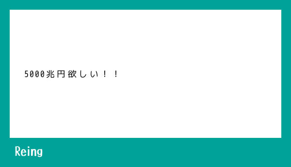
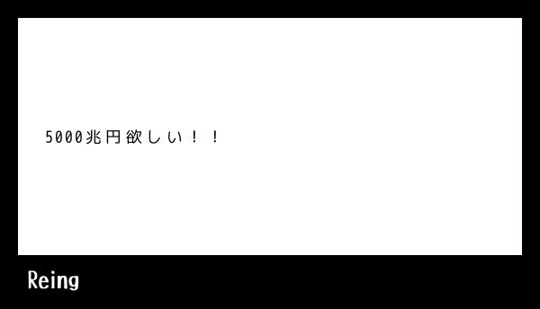
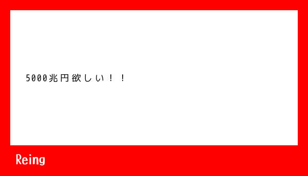

## How to use

```console
$ cargo run -- --help

USAGE:
    text2image [OPTIONS] <TEXT>

FLAGS:
    -h, --help       Prints help information
    -V, --version    Prints version information

OPTIONS:
        --brand <BRAND>    Brand text. Default: Reing
        --output <path>    Output file path. Default: ./output.jpg
        --rgb <RGB>        Background color. Default: 00,A2,9A

ARGS:
    <TEXT>    Text to write.
```

## Example

### Basic

```console
$ cargo run -- '5000兆円欲しい！！' --output example/5000tyouen.jpg
```



### Custom brand text

You can change brand text (bottom left).

```console
$ cargo run -- '5000兆円欲しい！！' --brand "5000兆円" --output example/5000tyouen_with_brand.jpg
```


### Custom color

You can change image color.

"Dark mode":

```console
$ cargo run -- '5000兆円欲しい！！' --rgb 00,00,00 --output example/5000tyouen_custom_color_black.jpg
```



"Red mode":

```console
$ cargo run -- '5000兆円欲しい！！' --rgb FF,00,00 --output example/5000tyouen_custom_color_red.jpg
```



### PNG support

You can change output image file type. Just change the output filename.

```console
$ cargo run -- '5000兆円欲しい！！' --output example/5000tyouen.png
```
